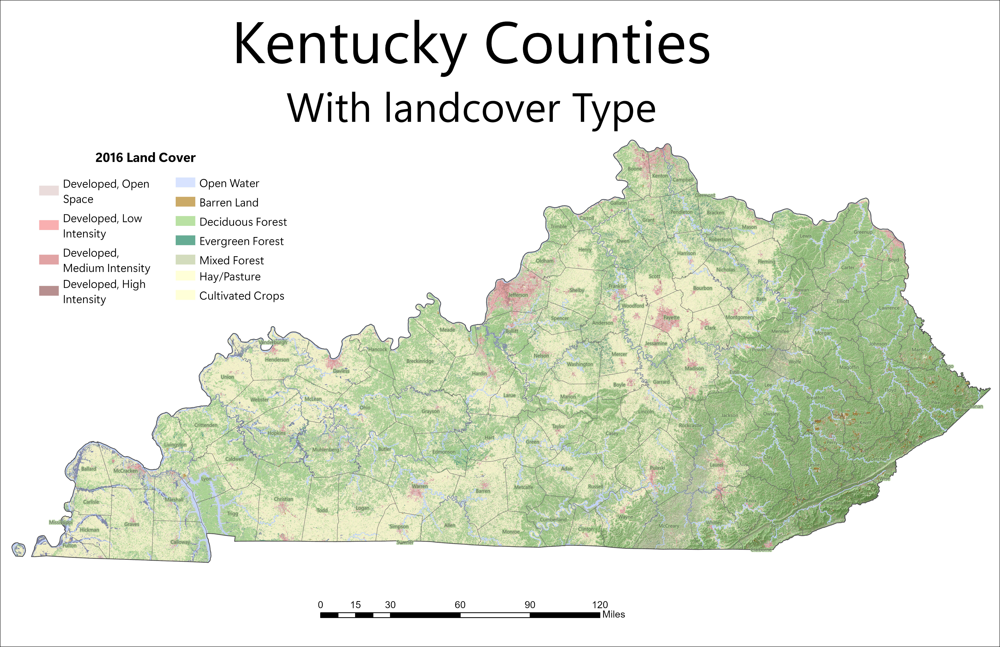

# geo409-field-trip

This webpage shows the Kentucky land cover and University of Kentucky Campus tree canopy heights. The maps and the cite were created by Valerie Gibson on March 9th, 2025. 

* Clipping for the area of Kentucky and the boundary of campus was used respectively 
* Data from kyraster.ky.gov
* NDVI greater than 0.05 and Height greater than 5 feet used to find trees
* 2016 National Landcover dataset used for the Kentucky Land Cover Map

## Kentucky Land Cover Map

*Download [GeoPDF](Kentucky-Landcover.pdf)*

## University of Kentucky Campus Tree Map

*Download [GeoPDF](Tree-Model.pdf)*

